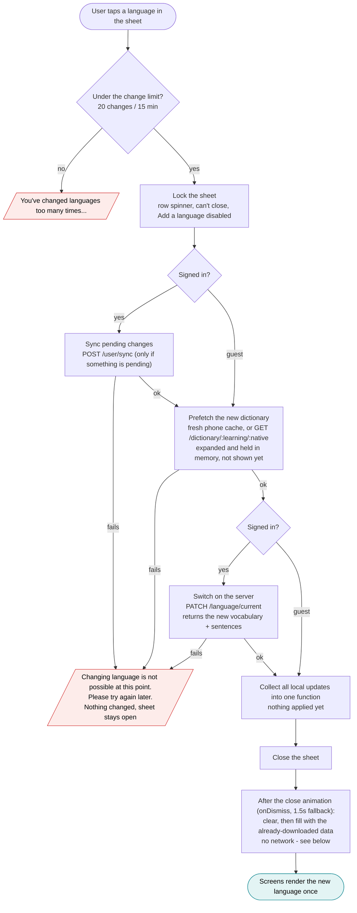
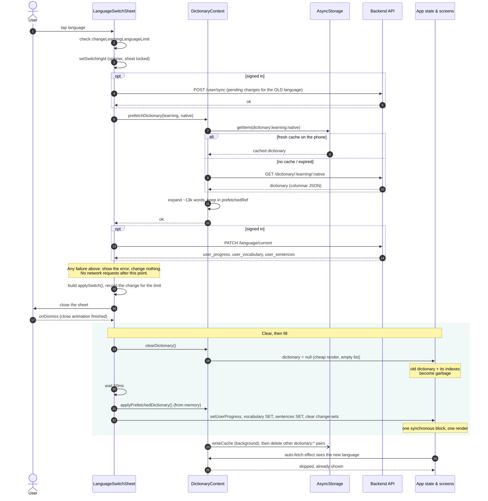
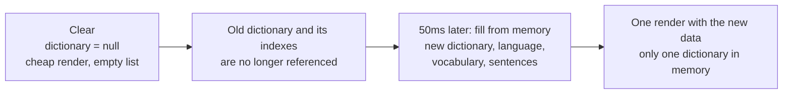

# Atomic language switching

How the app switches the user's current learning language. On the phone
the switch is **atomic**: the local state is either fully the old language
or fully the new one (dictionary, current language, vocabulary, sentences),
never a mix. If anything fails, nothing changes and the user sees an error.
The phone and the server can briefly disagree in two rare cases - see
[What is and isn't guaranteed](#what-is-and-isnt-guaranteed).

Code:
- `frontend/components/LanguageSwitchSheet.tsx` - `handleSelect`, `runPendingSwitch`
- `frontend/context/DictionaryContext.js` - `prefetchDictionary`, `clearDictionary`, `applyPrefetchedDictionary`
- `frontend/utils/learningLanguageChangeLimit.js` - client-side change limit

## Overview

Every network request runs **before** anything local changes: the sync,
the dictionary download and the server switch. Only when all of them
succeed are the local updates applied, after the sheet has closed. Applying
them needs no network - the new dictionary is already in memory.

## Step by step

## Clear, then fill

The new data is applied in two steps, so the old and the new dictionary are
never in memory at the same time. Each dictionary has around 13-14k words,
plus the indexes built from it, so keeping only one at a time keeps memory
and garbage collection low.

Both steps are local. The new dictionary was already downloaded (or read
from the phone's cache) by `prefetchDictionary` before the clear, so losing
the internet connection between the clear and the fill changes nothing.

## What is and isn't guaranteed

Guaranteed:

- **No partial state on the phone**: the sync, the dictionary download and
  the server switch all succeed before any local state changes. If one of
  them fails, the current language, vocabulary, sentences and dictionary
  stay exactly as they were.
- **No network needed to apply**: clear and fill only use data that is
  already in memory, so a lost connection after the server switch can't
  leave the phone without a dictionary.
- **One render**: dictionary, current language, vocabulary and sentences are
  applied in one synchronous block, so screens never match the new
  vocabulary against the old dictionary.
- **No double download**: the auto-fetch that follows the switch finds the
  pair already shown and does nothing.
- **Locked sheet**: while a switch or add is running, swipe-down, backdrop
  tap and the Android back button can't close the sheet, and "Add a
  language" is disabled.
- **Rate limit**: the app allows 20 language changes per 15 minutes, the same
  as the backend's dictionary limit (20 requests per 15 minutes per IP).
- **One pair on the phone**: after the new dictionary is cached, other
  cached pairs are deleted.

Not guaranteed - the phone and the server can briefly disagree (signed-in
users only):

- **The server switches but the response is lost**: if the connection drops
  after the server has processed `PATCH /language/current`, the app shows
  the error and stays on the old language, while the server is already on
  the new one.
- **The app is killed between the server switch and the fill**: this window
  is about 0.7s (the sheet's close animation plus 50ms). The server has the
  new language, the phone still has the old one saved.

In both cases the phone's own state is still consistent (fully the old
language), and the two sides are back in sync the next time the app loads
the user's progress from the server, e.g. on the next login.
